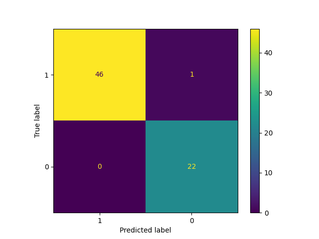
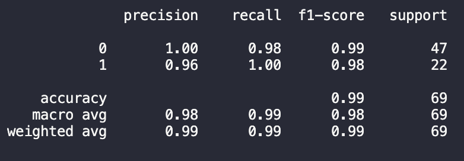

# [Logistic Regression](https://www.ibm.com/topics/logistic-regression)

In this repository I implement logistic regression from scratch. I utilized sklearn to split the training/test data and find the scores. I also utilized matplotlib to communicate my scores with a confusion matrix, as shown below.

As [IBM](https://www.ibm.com/topics/logistic-regression) puts it, 

*"Logistic regression estimates the probability of an event occurring, such as voted or didn’t vote, based on a given dataset of independent variables. Since the outcome is a probability, the dependent variable is bounded between 0 and 1.This type of statistical model (also known as logit model) is often used for classification and predictive analytics."*

## Data utilized
The data utilized can be found [here](https://allisonhorst.github.io/palmerpenguins/), and the paper that was published along with the data can be found [here](https://journals.plos.org/plosone/article?id=10.1371/journal.pone.0090081#s3).

There are 

1) 344 Instances

2) 17 features
    
    a. studyName
     
    b. SampleNumber
     
    c. Species
     
    d. Region
     
    e. Island
     
    f. Stage
     
    g. IndividualID
     
    h. ClutchCompletion
     
    i. DateEgg
     
    j. CulmenLength_mm
     
    k. CulmenDepth_mm
     
    l. FlipperLength_mm
     
    m. BodyMass_g
     
    n. Sex
     
    o. Delta15N
     
    p. Delta13C
     
    q. Comments

 

### Confusion Matrix

### Scores

